# The Gentle Path

## Introduction 

The Gentle Path is my first assessed portfolio project developed as part of the Code Institute Full Stack Software Developer Bootcamp, consisting of learning outcomes to utilise HTML5, CSS3 & Bootstrap in order to fulfil the necessary requirements for the brief provided about Mental Health. 

<a href="https://ac-dev16.github.io/gentle-path/" target="_blank">View the live project here.</a>

<h2 align="center" id="TOC">Table of Contents</h2>

* [The Gentle Path](#the-gentle-path)
  - [Introduction](#introduction)
  - [Table of Contents](#TOC)
  - [Project Outline](#project-outline)
* [Features](#features)
  - [Navigation](#navigation)
  - [Hero section](#hero-section)
  - [Bootstrap Carousel](#bootstrap-carousel)
  - [About Section](#about-section)
  - [Where To Start](#where-to-start)
  - [Help and Support](#help-and-support)
  - [Footer](#footer)
  - [Contact](#contact)
  - [Learn Page](#learn-page)
  - [Features Left To Implement](#features-left-to-implement)
* [Built With](#built-with)
  - [Technology and Languages](#technologies-and-languages)
  - [Libraries and Frameworks](#libraries-and-frameworks)
  - [Tools & Programs](#tools-and-programs)
* [Deployment](#deployment)
* [Testing](#testing)
    - [Validation](#validation)
    - [Lighthouse](#lighthouse)
* [Credits](#credits)
  - [Code](#code)
  - [Content](#content)
  - [Media](#media)

## Project Outline

The Gentle Path is a sanctuary for individuals living with chronic pain, offering beginner friendly information to support mental health, wellness, and emotional resilience. The site is designed to foster hope and healing through tranquil visuals, empowering quotes, and practical wellness strategies. The Gentle Path helps users feel seen, soothed, and supported through engaging in online group sessions for community-driven inspiration and personal one-on-one support from trained therapists —encouraging small, sustainable steps toward greater peace, strength, and self-care.

## Features

### Navigation

- The navbar is a Bootstrap component that allows for easy navigation and responsive design. It is used across all pages with a simple, neutral coloured design with links to the Logo, Home, Learn and Contact. Links to Practise and Resources are not yet available.

- The navbar will allow the user to easily navigate from page to page across all devices without having to revert back to the previous page via the ‘back’ button. Active links become bold when navigating through pages so the user know which area they are currently using.

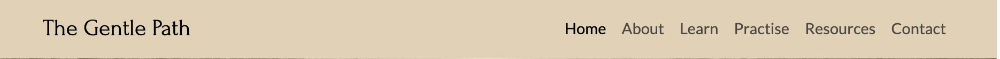

### Hero section

- **Visual Theme:** The AI generated hero image evokes serenity and resilience through soft, natural tones and symbolic elements like a winding path, gentle light, and tranquil landscapes—reflecting the emotional journey of chronic pain and healing.

- **Purpose and Impact:** Designed to immediately convey comfort and hope, the image sets the emotional tone for the site, inviting users into a safe, supportive space where wellness and mental health are prioritized.

- **Brand Alignment:** The composition aligns with The Gentle Path’s core values—empathy, empowerment, and transformation—serving as a visual anchor for the site's identity and reinforcing its mission to uplift and connect.

- **Text:** The text welcomes users to the site and has a brief sentence to explain the sites purpose.

- **Buttons:** Two button are placed in the lower righthand corner. The "Need Help?" button allows a user to be directed straight to the Help and Support section. The "Start Guided Meditation" button gives the user the opportunity to try a meditation session through a link to a YouTube video by 'Lavendaire'.

### Bootstrap carousel

- **Dynamic Affirmation Display:** The Bootstrap carousel cycles through uplifting affirmations, creating a gentle rhythm of encouragement that reinforces the site's themes of resilience, hope, and emotional support.

- **Responsive and Accessible:** Optimized for all screen sizes, the carousel ensures affirmations remain visually engaging and easy to read, offering users a calming, interactive experience across devices.

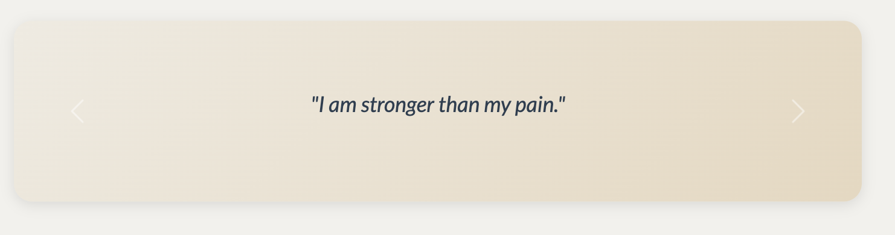

### About section

- **Responsive Design for Accessibility:** The use of Bootstrap card layout adapts across all devices, ensuring that our message remains clear, comforting, and easy to navigate whether viewed on mobile, tablet, or desktop.

- **Structured Storytelling:** Bootstrap cards organize key elements of Our Mission and What We Offer (empathy, empowerment, and holistic wellness) into digestible, visually distinct segments that guide users through our purpose and values.

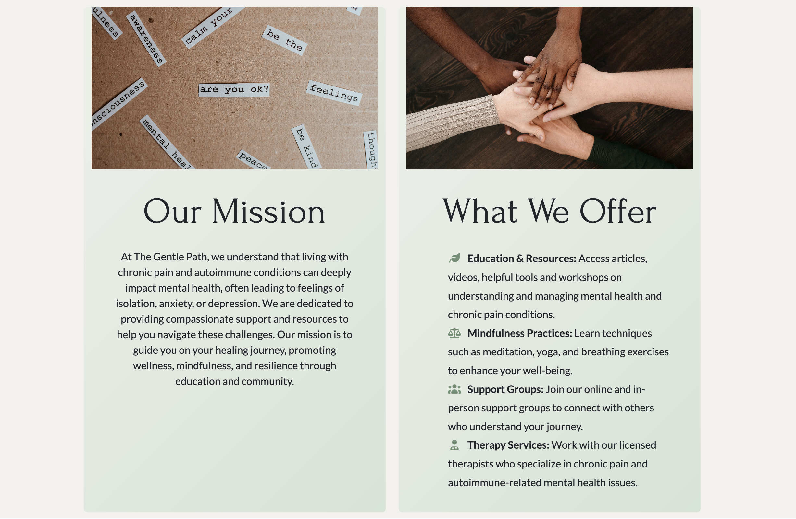

### Where To Start

- **User-Centered Clarity:** Dealing with chronic pain can be a difficult and confusing time with many people not knowing where to begin to get thier life back on track. Each card in this section highlights a specific stage in order for users to begin understand and cope with their mental health issues and struggles through chronic pain. It helps users quickly understand how The Gentle Path can assist them on their healing journey.

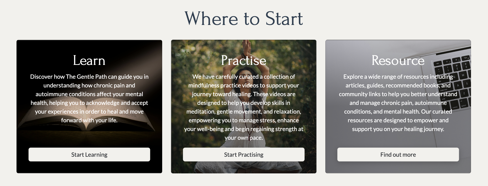

### Help and Support

- **Access to Support:** The section provides clear, actionable options “Helpline” and “Book Online Session”, allowing users to quickly connect with emotional and wellness support tailored to chronic pain and mental health needs.

- **Intuitive Circular Design:** Circular containers draw visual attention and convey peace and approachability, reinforcing the site's gentle aesthetic while making key support features easy to identify and engage with.

- **Fully Responsive Layout:** This section ensures seamless access to help resources whether users are browsing on mobile, tablet, or desktop—support is always within reach.

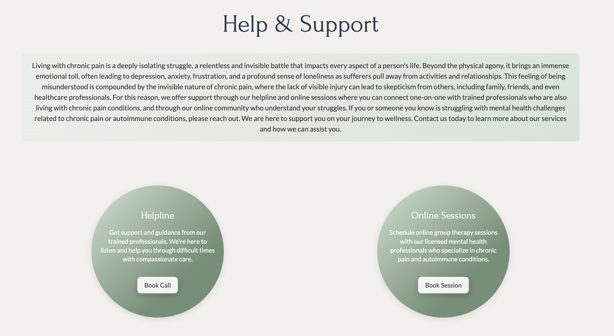

### Footer

- **Visual Consistency:** Matching the footer color to the navbar creates a cohesive, polished look across the site, reinforcing brand identity and promoting a calm, unified aesthetic.

- **Accessible Connectivity:** Evenly spaced social media icons offer users clear, balanced access to external platforms, encouraging community engagement while maintaining visual harmony and ease of navigation.

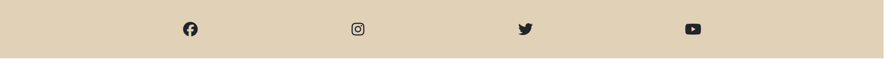

### Contact

- **Contact Form Integration:** A responsive contact form allows visitors to reach out with questions, feedback, or support requests. It’s styled consistently with The Gentle Path’s serene visual identity, using the same calming colour palette and layout structure as the rest of the site.

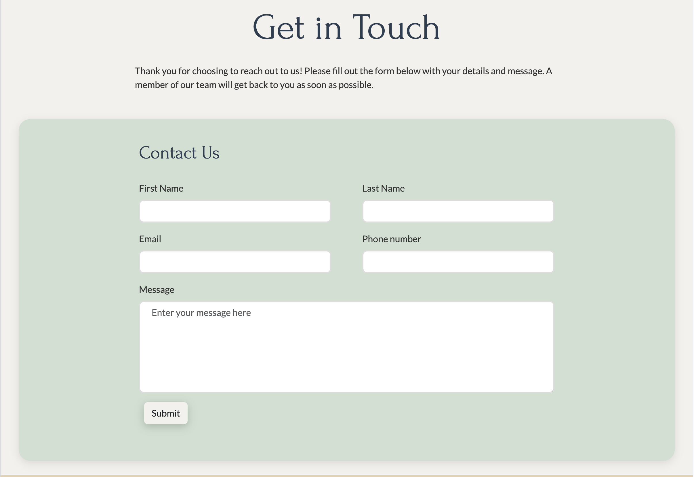

 

### Learn Page

- **Supportive Mental Health Education:** The Learn page gently guides users living with chronic pain, toward understanding the connection between physical and emotional wellbeing. It offers clear, compassionate information on mental health, therapy options, and coping strategies to help users take the first step in managing their inner world.

- **Consistent, Calming Design:** Styled in harmony with the site’s tranquil aesthetic, the Learn page maintains the same soft colour palette, typography, and layout as other sections—creating a peaceful, cohesive experience that encourages exploration without overwhelm.

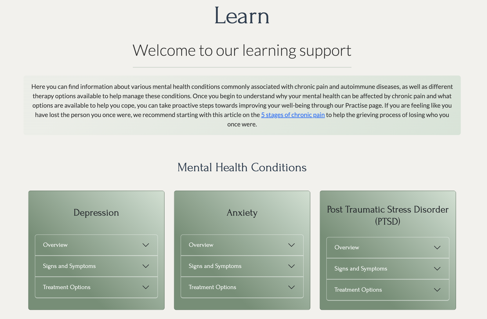

### Features Left to Implement

- **Practise Page** The Practice page would offer users a calming, supportive space to explore holistic techniques—like meditation, breathwork, yoga, gentle movement, and nutrition advice—alongside practical coping strategies and tools that nurture both body and mind on the journey through chronic pain and emotional healing.

- **Resources Page** The Resources page would serve as a curated hub for deeper exploration, offering trusted links, insightful articles, and expert-backed content to empower users with knowledge and practical guidance.

<a href="#the-gentle-path">Back To Top</a>

## Wireframe

- The project's wireframes serve as the skeletal blueprint, illustrating the foundational structure, layout, and functionality of the application before visual design elements were applied. They were developed to map out the user flow and hierarchy of information, ensuring a logical and intuitive user experience.

- There were minor alterations during the building process to improve the flow of the document and user experience.

<a href="#the-gentle-path">Back To Top</a>

## Built With

### Technologies and Languages

- HTML5
- CSS3
- GitHub

### Libraries and Frameworks

- Bootstrap v5.3.8
- Font Awesome
- Google Fonts

### Tools and Programs

- MS CoPilot
- VSCode CoPilot

## Deployment

The site was deployed to GitHub pages. The steps to deploy are as follows:

- Go to the Settings tab of your GitHub repo.
- On the left-hand sidebar, in the Code and automation section, select Pages.
- Make sure the source is set to 'Deploy from Branch'.
- Make sure the main branch is selected.
- Make sure the folder is set to / (root).
- Under Branch, click Save.
- Go back to the Code tab and wait a few minutes before refreshing.
- On the right-hand side in the Deployments section click on 'github-pages'.
- The latest deployed link will appear at the top of the page.

<a href="#the-gentle-path">Back To Top</a>

## Testing

### Validation

#### CSS

No errors found. 1 warning from imported style sheet which are outside of the scope of the project.

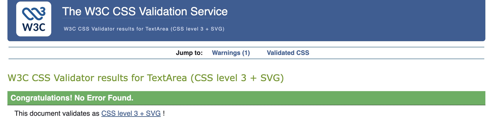

<a href="#the-gentle-path">Back To Top</a>

#### HTML

**Landing Page**
No errors found on second validation.
The first check of my HTML raised a few errors regarding header semantics which I quickly corrected.

**Learn Page**
No errors found on second validation.
On my first attempt there were 62 errors. These were all linked to duplicate ID's on the card accordions which is why they weren't working as expected. ID's were changed and everything works correctly.

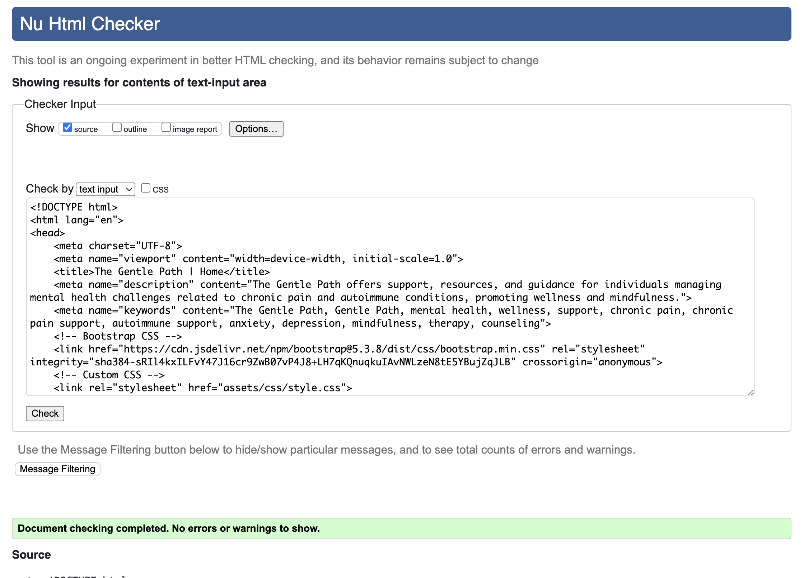

<a href="#the-gentle-path">Back To Top</a>

### Lighthouse

A Lighthouse audit was conducted using the tool on Chrome Devtools of each web page.

**Home Page**
I initially had a performance score of 77 due to the size of the images. I scaled down the size on all .jpg images and improved my score to 79. It was my hero image that was causing the poor performance so I used [Photopea](https://www.photopea.com) to change my AI generated .png image into .webp and ran the lighthouse again and its increased to 98.

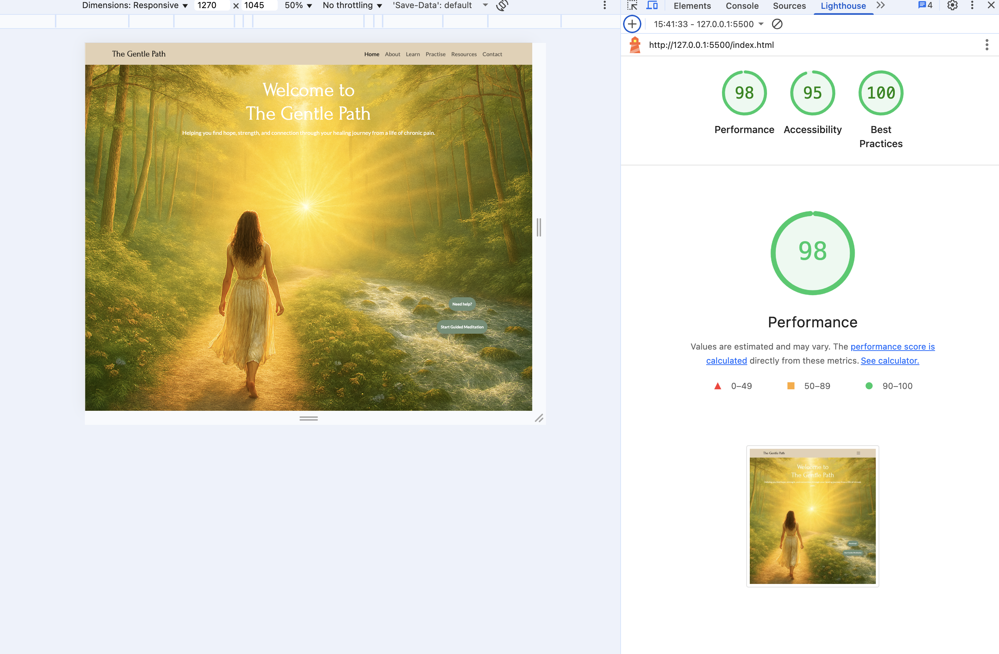

<a href="#the-gentle-path">Back To Top</a>

**Learn Page**

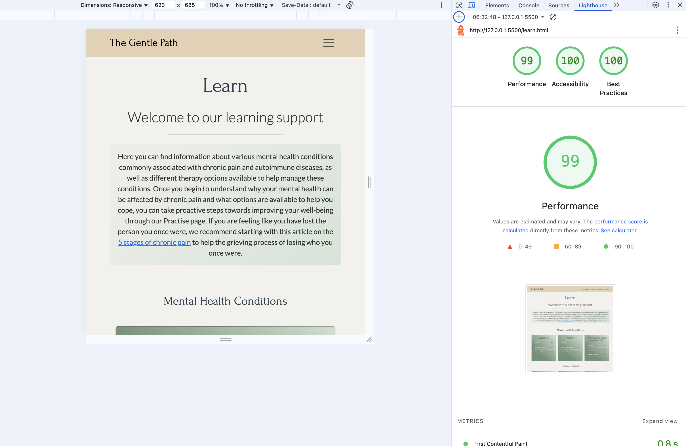

<a href="#the-gentle-path">Back To Top</a>

**Contact Page** 

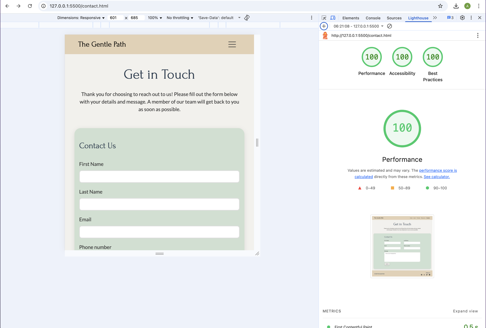

<a href="#the-gentle-path">Back To Top</a>

**Sucess Page**

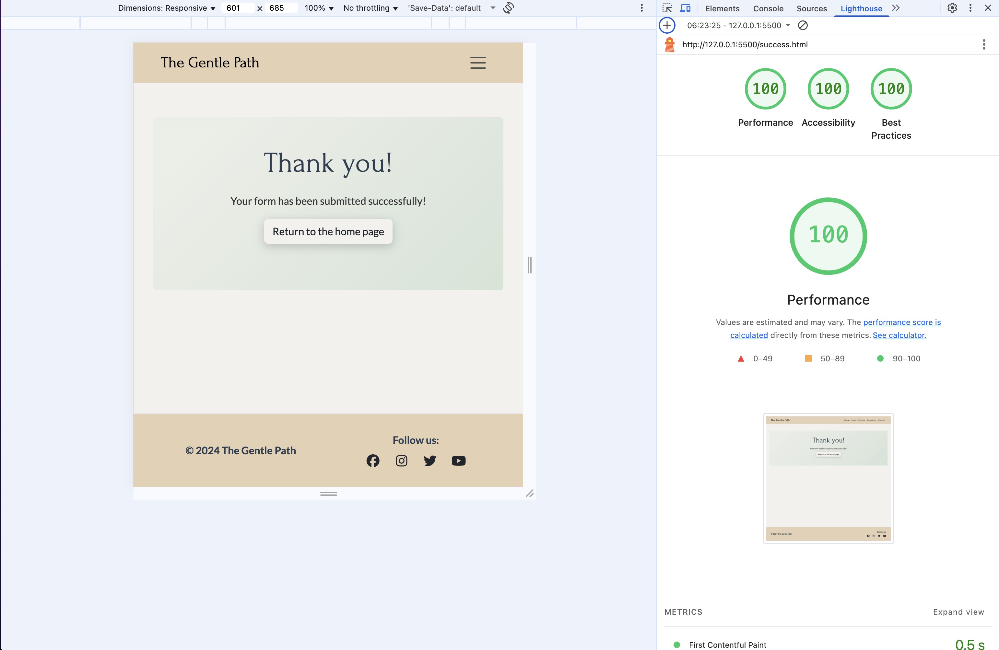

<a href="#the-gentle-path">Back To Top</a>

## Credits

### Code 

- Bootstrap was used for most of the layout.
- Copilot used to help style "Helpline" and "Online Session" circular containers and altered manually to match the style of the website.
- AI was used to assist with debugging.

### Content

- Most of the main text content was generated using AI Copilot
- Icons in the footer and about section were from Font Awesome.

### Media

- The images used on the Home page cards are from [Pexels](https://www.pexels.com)
- Hero image was generated using Copilot and changed to .webp using [Photopea](https://www.photopea.com)
- Favicon created at [favicon.io](https://www.favicon.io)

<a href="#the-gentle-path">Back To Top</a>
